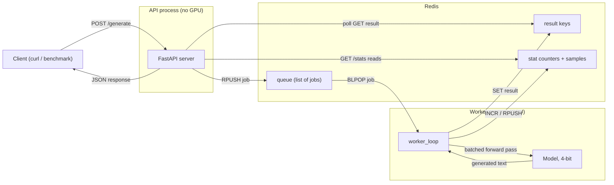

# nanoinference

<p>
  
  &nbsp;
  
  &nbsp;
  
  &nbsp;
  
</p>

nanoinference is a small GPU inference server for language models, built from scratch to understand how systems like vLLM and TGI actually work under the hood. It takes prompts over an HTTP API, batches concurrent requests together, and runs them on a single GPU with enough metrics that you can watch the latency-vs-throughput tradeoffs happen in real time.

It is not trying to beat a production inference server. This is a learning project: the point is to build the real pieces one layer at a time, and actually understand each one instead of importing it.

It runs as two separate processes, an API server and a GPU worker, coordinating through Redis. The API holds no model and needs no GPU; the worker does the inference. See the roadmap below for what's next.

## What it's built around

A few things I wanted to hold to while building it:

- **Understand before optimizing.** Each piece is written by hand before reaching for a library that hides it. The batching loop, the queue, the metrics are all visible in plain code.
- **Measure everything.** Batch size, throughput, and p95 latency are tracked and exposed on an endpoint, not guessed at.
- **One GPU, real models.** 4-bit quantization so a 7B-parameter model fits on a 12 GB consumer card.
- **Stay responsive under load.** An async FastAPI front end that keeps accepting requests while the GPU is mid-generation.

## How it works

A client sends a prompt to `POST /generate` on the API server. The API pushes the job onto a Redis queue and waits for a result key. The worker process pops the job, waits a few milliseconds to see if other requests show up, groups whatever it has into a batch, runs the batch through the model in a single GPU pass, and writes each result back to Redis for the API to return.

Batching is the part that matters. Loading the model's weights is the expensive step, and it costs the same whether you're serving one prompt or eight. Grouping requests means you pay that cost once and reuse it across the whole batch, which is where the throughput gain comes from.



## What works today

Actually implemented and running:

- **Separate API and worker processes** coordinating over a Redis queue, so the API needs no GPU and the worker can run anywhere Redis is reachable.
- **Dynamic batching**: the worker collects concurrent requests within a short window and runs them as one batch, with left-padding and a per-model chat template applied automatically.
- **Metrics**: request count, batch size, tokens/sec, and average/p95 latency, exposed via `GET /stats` and clearable with `POST /reset`.
- **4-bit quantization**: optional bitsandbytes loading so 7B models run in ~5 GB of VRAM instead of ~28 GB at full precision.
- **Async architecture**: the blocking `model.generate()` call is pushed to a background thread so the event loop stays free to accept requests.
- **Load-testing tool**: `experiments/benchmark.py` fires N concurrent requests at a chosen concurrency and reports client-side throughput/latency alongside the server's own stats.

## Roadmap

Roughly in the order I plan to build it:

- **Multiple GPU workers** with a scheduler, health checks, and retries
- **Observability**: Prometheus metrics and Grafana dashboards instead of hard coded counters
- **KV cache reuse** across requests, and streaming token responses

## Results

Measured on a single RTX 4070 (12 GB), 40-request burst at concurrency 10, distilgpt2:

| Setting | Requests/sec | p95 latency |
| --- | --- | --- |
| Batch size 1 (batching off) | 10.3 | 1767 ms |
| Batch size 8 (batching on) | 28.1 | 939 ms |

So batching alone gave ~2.7x throughput and cut p95 latency roughly in half, by turning 40 separate GPU passes into 8. Swapping in larger models (TinyLlama-1.1B, Qwen2.5-7B) shows the expected tradeoff: more capable answers, lower throughput per pass.

## Quickstart

### Prerequisites

- Python 3.12
- An NVIDIA GPU with CUDA (it will fall back to CPU, just slowly)
- Docker, for running Redis

### Install

```bash
python -m venv venv
venv/bin/pip install -r requirements.txt
```

### Run

Three processes, each in its own terminal:

```bash
# 1. Redis
docker run -d --name nanoredis -p 6379:6379 redis

# 2. the GPU worker (loads the model, ~20s)
venv/bin/python worker/worker.py

# 3. the API server (starts instantly, no GPU)
venv/bin/uvicorn api.api_server:app --port 8000
```

First worker launch downloads the model into the Hugging Face cache. The model is set at the top of [worker/worker.py](worker/worker.py) via `MODEL_NAME`; 4-bit loading is controlled by the `BitsAndBytesConfig` just below it.

### Send a request

```bash
curl -X POST http://localhost:8000/generate \
  -H "Content-Type: application/json" \
  -d '{"prompt": "What is the capital of France?", "max_new_tokens": 40}'
```

### Benchmark it

```bash
venv/bin/python experiments/benchmark.py --requests 40 --concurrency 10
```

Reset the metrics between runs with `curl -X POST http://localhost:8000/reset`.

## Repository layout

- [api/api_server.py](api/api_server.py) &rarr; API server: endpoints, pushes jobs to Redis, reads results and stats
- [worker/worker.py](worker/worker.py) &rarr; GPU worker: loads the model, batching loop, writes results and stats to Redis
- [experiments/benchmark.py](experiments/benchmark.py) &rarr; async load tester
- [requirements.txt](requirements.txt) &rarr; dependencies

## License

Not yet licensed
